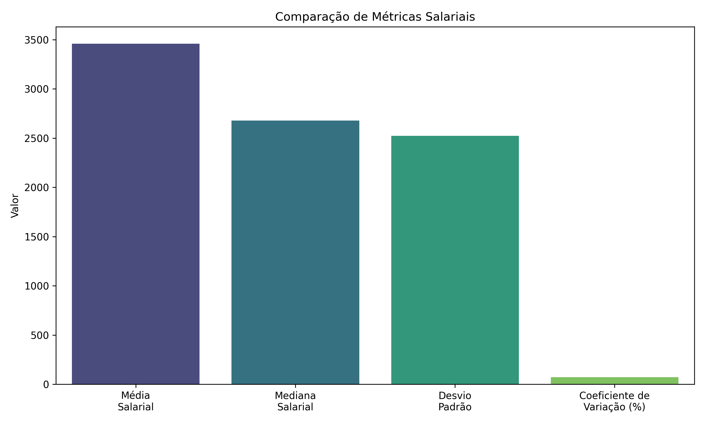
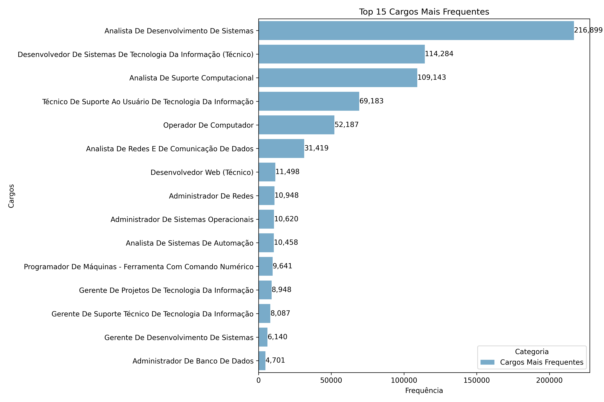
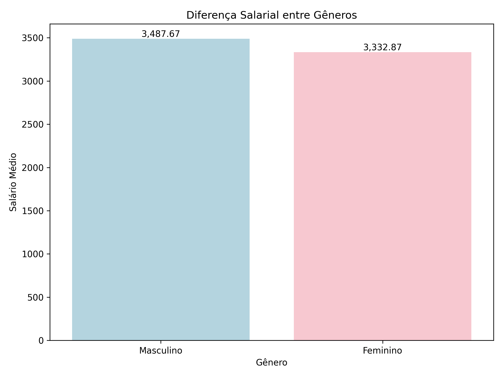

# 🧮 **Microdata Analysis Project**

Análise de microdados do mercado de trabalho focado em ocupações tecnológicas. Este projeto utiliza um pipeline de análise completo, incluindo carregamento, limpeza, visualização de dados e aplicação de modelos preditivos e testes estatísticos.

---

## 📂 **Estrutura do Projeto**

```plaintext
project/
│
├── data/                     # Dados brutos e processados
│   ├── raw/                  # Dados originais
│   │   └── microdados.csv
│   ├── processed/            # Dados processados
│
├── output/                   # Resultados do projeto (gráficos, relatórios)
│
├── src/                      # Código-fonte principal
│   ├── analysis/             # Classes de análise
│   │   ├── basic_statistics.py
│   │   ├── employment_indexes.py
│   │   ├── gender_analysis.py
│   │   ├── position_analysis.py
│   │   ├── predictive_models.py
│   │   ├── regional_analysis.py
│   │   └── statistical_tests.py
│   ├── data/                 # Classes para manipulação de dados
│   │   ├── data_filter.py
│   │   ├── data_loader.py
│   │   └── __init__.py
│   ├── report/               # Visualizadores e gerador de relatórios
│   │   ├── base_visualizer.py
│   │   ├── basic_statistics_visualizer.py
│   │   ├── employment_indexes_visualizer.py
│   │   ├── gender_analysis_visualizer.py
│   │   ├── position_analysis_visualizer.py
│   │   ├── predictive_models_visualizer.py
│   │   ├── statistical_tests_visualizer.py
│   │   ├── report_generator.py
│   │   └── __init__.py
│   ├── config.py             # Configuração do projeto
│   └── __init__.py
│
├── main.py                   # Arquivo principal para execução do projeto
├── README.md                 # Documentação do projeto
```

---

## 🚀 **Recursos Principais**

### 🧩 **Análises**
- **BasicStatistics**: Estatísticas descritivas básicas.
- **GenderAnalysis**: Análise de disparidade salarial por gênero.
- **PositionAnalysis**: Frequência e distribuição de cargos tecnológicos.
- **PredictiveModels**: Modelos de Regressão Linear e Logística.
- **EmploymentIndexes**: Índices de disparidade salarial e escolaridade.
- **RegionalAnalysis**: Concentração de empregos tecnológicos por região.
- **StatisticalTests**: Testes estatísticos (ANOVA, t-test).

### 📊 **Visualizadores**
- Histogramas, boxplots e gráficos de barras para estatísticas descritivas.
- Nuvens de palavras e gráficos de frequência de cargos.
- Mapas geográficos para visualização de concentração de empregos.
- Heatmaps de correlação entre variáveis.

---

## 🛠️ **Tecnologias Utilizadas**

- **Linguagem**: Python 3.9
- **Bibliotecas**:
  - Manipulação de dados: `pandas`, `numpy`
  - Visualização: `matplotlib`, `seaborn`, `wordcloud`
  - Modelagem estatística: `scikit-learn`, `scipy`
  - Manipulação de dados públicos: `basedosdados`

---

## 🗂️ **Como Configurar o Ambiente**

1. **Clone o repositório:**
   ```bash
   git clone https://github.com/usuario/microdata-analysis.git
   cd microdata-analysis
   ```

2. **Crie um ambiente virtual e ative-o:**
   ```bash
   python3 -m venv .venv
   source .venv/bin/activate  # Para Linux/Mac
   .venv\Scripts\activate     # Para Windows
   ```

3. **Instale as dependências:**
   ```bash
   pip install -r requirements.txt
   ```

---

## 🔑 **Como Executar**

1. Coloque o arquivo de dados original em `data/raw/microdados.csv`.

2. Execute o arquivo principal:
   ```bash
   python main.py
   ```

3. Os gráficos e relatórios gerados serão salvos em `output/`.

---

## 📈 **Exemplo de Gráficos Gerados**

### 📊 Estatísticas Básicas


### 🌍 Top 15 Cargos


### 📑 Disparidade Salarial por Gênero


---

## 🛡️ **Contribuição**

1. Faça um fork do repositório.
2. Crie uma branch para sua contribuição:
   ```bash
   git checkout -b feature/nova-analise
   ```
3. Envie um pull request!

---

## 📜 **Licença**

Este projeto está licenciado sob a licença **MIT**.

---
